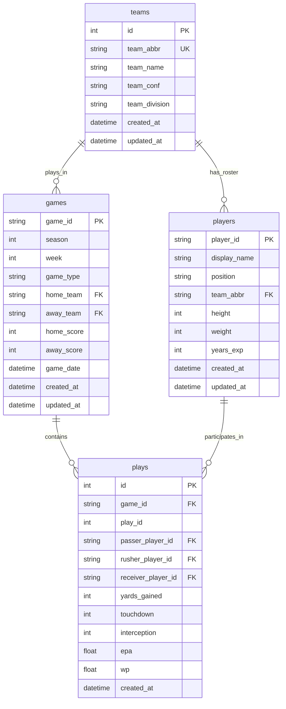

# Database Schema

The NFL Analysis Engine uses PostgreSQL with SQLAlchemy ORM, designed to be compatible with nflfastR data structure while adding analysis-specific enhancements.

## Schema Overview



## Core Tables

### Teams Table
Stores NFL team information with conference and division structure.

```sql
CREATE TABLE teams (
    id SERIAL PRIMARY KEY,
    team_abbr VARCHAR(5) UNIQUE NOT NULL,
    team_name VARCHAR(100) NOT NULL,
    team_conf VARCHAR(10) NOT NULL,  -- AFC/NFC
    team_division VARCHAR(20) NOT NULL,  -- AFC West, NFC North, etc.
    team_color VARCHAR(7),  -- Primary hex color
    team_color2 VARCHAR(7), -- Secondary hex color
    created_at TIMESTAMP DEFAULT CURRENT_TIMESTAMP,
    updated_at TIMESTAMP DEFAULT CURRENT_TIMESTAMP
);

-- Indexes
CREATE INDEX idx_teams_abbr ON teams(team_abbr);
CREATE INDEX idx_teams_division ON teams(team_division);
CREATE INDEX idx_teams_conference ON teams(team_conf);
```

**Sample Data:**
```sql
INSERT INTO teams (team_abbr, team_name, team_conf, team_division) VALUES
('KC', 'Kansas City Chiefs', 'AFC', 'AFC West'),
('BUF', 'Buffalo Bills', 'AFC', 'AFC East'),
('SF', 'San Francisco 49ers', 'NFC', 'NFC West'),
('DAL', 'Dallas Cowboys', 'NFC', 'NFC East');
```

### Games Table
Stores game information including scores, dates, and metadata.

```sql
CREATE TABLE games (
    game_id VARCHAR(20) PRIMARY KEY,
    season INTEGER NOT NULL,
    week INTEGER NOT NULL,
    game_type VARCHAR(10) NOT NULL,  -- REG, POST, PRE
    game_date TIMESTAMP NOT NULL,
    home_team VARCHAR(5) NOT NULL REFERENCES teams(team_abbr),
    away_team VARCHAR(5) NOT NULL REFERENCES teams(team_abbr),
    home_score INTEGER,
    away_score INTEGER,
    total_plays INTEGER DEFAULT 0,
    home_timeouts_remaining INTEGER,
    away_timeouts_remaining INTEGER,
    created_at TIMESTAMP DEFAULT CURRENT_TIMESTAMP,
    updated_at TIMESTAMP DEFAULT CURRENT_TIMESTAMP
);

-- Indexes
CREATE INDEX idx_games_season ON games(season);
CREATE INDEX idx_games_week ON games(week);
CREATE INDEX idx_games_date ON games(game_date);
CREATE INDEX idx_games_home_team ON games(home_team);
CREATE INDEX idx_games_away_team ON games(away_team);
CREATE INDEX idx_games_season_week ON games(season, week);
```

**Sample Data:**
```sql
INSERT INTO games (game_id, season, week, game_type, game_date, home_team, away_team, home_score, away_score) VALUES
('2024_01_KC_BUF', 2024, 1, 'REG', '2024-09-08 13:00:00', 'KC', 'BUF', 31, 17),
('2024_01_SF_DAL', 2024, 1, 'REG', '2024-09-08 16:25:00', 'SF', 'DAL', 28, 14);
```

### Players Table
Stores NFL player information with position and physical attributes.

```sql
CREATE TABLE players (
    player_id VARCHAR(20) PRIMARY KEY,
    display_name VARCHAR(100) NOT NULL,
    position VARCHAR(10),
    team_abbr VARCHAR(5) REFERENCES teams(team_abbr),
    height INTEGER,  -- inches
    weight INTEGER,  -- pounds
    years_exp INTEGER,
    college VARCHAR(100),
    birth_date DATE,
    jersey_number INTEGER,
    created_at TIMESTAMP DEFAULT CURRENT_TIMESTAMP,
    updated_at TIMESTAMP DEFAULT CURRENT_TIMESTAMP
);

-- Indexes
CREATE INDEX idx_players_position ON players(position);
CREATE INDEX idx_players_team ON players(team_abbr);
CREATE INDEX idx_players_name ON players(display_name);
CREATE INDEX idx_players_position_team ON players(position, team_abbr);
```

**Sample Data:**
```sql
INSERT INTO players (player_id, display_name, position, team_abbr, height, weight, years_exp) VALUES
('00-0033873', 'Patrick Mahomes', 'QB', 'KC', 75, 230, 8),
('00-0034796', 'Josh Allen', 'QB', 'BUF', 77, 237, 7),
('00-0023459', 'Travis Kelce', 'TE', 'KC', 77, 260, 12);
```

### Plays Table
Stores play-by-play data compatible with nflfastR schema.

```sql
CREATE TABLE plays (
    id SERIAL PRIMARY KEY,
    game_id VARCHAR(20) NOT NULL REFERENCES games(game_id),
    play_id INTEGER NOT NULL,
    season INTEGER NOT NULL,
    week INTEGER NOT NULL,
    posteam VARCHAR(5),  -- Possession team
    defteam VARCHAR(5),  -- Defense team
    play_type VARCHAR(20),
    yards_gained INTEGER DEFAULT 0,
    touchdown INTEGER DEFAULT 0,
    interception INTEGER DEFAULT 0,
    fumble_lost INTEGER DEFAULT 0,
    safety INTEGER DEFAULT 0,
    
    -- Player involvement
    passer_player_id VARCHAR(20) REFERENCES players(player_id),
    rusher_player_id VARCHAR(20) REFERENCES players(player_id),
    receiver_player_id VARCHAR(20) REFERENCES players(player_id),
    
    -- Advanced metrics
    epa DECIMAL(6,3),  -- Expected Points Added
    wp DECIMAL(6,3),   -- Win Probability
    wpa DECIMAL(6,3),  -- Win Probability Added
    
    -- Situational data
    down INTEGER,
    ydstogo INTEGER,
    yardline_100 INTEGER,
    quarter_seconds_remaining INTEGER,
    half_seconds_remaining INTEGER,
    game_seconds_remaining INTEGER,
    score_differential INTEGER,
    
    -- Game state
    no_huddle INTEGER DEFAULT 0,
    qb_dropback INTEGER DEFAULT 0,
    qb_kneel INTEGER DEFAULT 0,
    qb_spike INTEGER DEFAULT 0,
    
    created_at TIMESTAMP DEFAULT CURRENT_TIMESTAMP
);

-- Indexes for performance
CREATE INDEX idx_plays_game_id ON plays(game_id);
CREATE INDEX idx_plays_season ON plays(season);
CREATE INDEX idx_plays_passer ON plays(passer_player_id);
CREATE INDEX idx_plays_rusher ON plays(rusher_player_id);
CREATE INDEX idx_plays_receiver ON plays(receiver_player_id);
CREATE INDEX idx_plays_posteam ON plays(posteam);
CREATE INDEX idx_plays_epa ON plays(epa);
CREATE INDEX idx_plays_wp ON plays(wp);
CREATE INDEX idx_plays_play_type ON plays(play_type);
CREATE INDEX idx_plays_down_distance ON plays(down, ydstogo);

-- Composite indexes for common queries
CREATE INDEX idx_plays_season_posteam ON plays(season, posteam);
CREATE INDEX idx_plays_game_play_id ON plays(game_id, play_id);
```

## SQLAlchemy Models

### Base Model
All models inherit from a base class with common functionality:

```python
from sqlalchemy import Column, Integer, DateTime, func
from sqlalchemy.ext.declarative import declarative_base

Base = declarative_base()

class BaseModel(Base):
    __abstract__ = True
    
    created_at = Column(DateTime, default=func.now())
    updated_at = Column(DateTime, default=func.now(), onupdate=func.now())
    
    def to_dict(self):
        return {c.name: getattr(self, c.name) for c in self.__table__.columns}
```

### Team Model

```python
from sqlalchemy import Column, Integer, String
from sqlalchemy.orm import relationship

class TeamModel(BaseModel):
    __tablename__ = "teams"
    
    id = Column(Integer, primary_key=True)
    team_abbr = Column(String(5), unique=True, nullable=False)
    team_name = Column(String(100), nullable=False)
    team_conf = Column(String(10), nullable=False)
    team_division = Column(String(20), nullable=False)
    team_color = Column(String(7))
    team_color2 = Column(String(7))
    
    # Relationships
    home_games = relationship("GameModel", foreign_keys="GameModel.home_team", back_populates="home_team_obj")
    away_games = relationship("GameModel", foreign_keys="GameModel.away_team", back_populates="away_team_obj")
    players = relationship("PlayerModel", back_populates="team_obj")
```

### Game Model

```python
from sqlalchemy import Column, String, Integer, DateTime, ForeignKey
from sqlalchemy.orm import relationship

class GameModel(BaseModel):
    __tablename__ = "games"
    
    game_id = Column(String(20), primary_key=True)
    season = Column(Integer, nullable=False)
    week = Column(Integer, nullable=False)
    game_type = Column(String(10), nullable=False)
    game_date = Column(DateTime, nullable=False)
    home_team = Column(String(5), ForeignKey("teams.team_abbr"), nullable=False)
    away_team = Column(String(5), ForeignKey("teams.team_abbr"), nullable=False)
    home_score = Column(Integer)
    away_score = Column(Integer)
    total_plays = Column(Integer, default=0)
    
    # Relationships
    home_team_obj = relationship("TeamModel", foreign_keys=[home_team])
    away_team_obj = relationship("TeamModel", foreign_keys=[away_team])
    plays = relationship("PlayModel", back_populates="game")
```

### Player Model

```python
from sqlalchemy import Column, String, Integer, Date, ForeignKey
from sqlalchemy.orm import relationship

class PlayerModel(BaseModel):
    __tablename__ = "players"
    
    player_id = Column(String(20), primary_key=True)
    display_name = Column(String(100), nullable=False)
    position = Column(String(10))
    team_abbr = Column(String(5), ForeignKey("teams.team_abbr"))
    height = Column(Integer)
    weight = Column(Integer)
    years_exp = Column(Integer)
    college = Column(String(100))
    birth_date = Column(Date)
    jersey_number = Column(Integer)
    
    # Relationships
    team_obj = relationship("TeamModel", back_populates="players")
    passing_plays = relationship("PlayModel", foreign_keys="PlayModel.passer_player_id")
    rushing_plays = relationship("PlayModel", foreign_keys="PlayModel.rusher_player_id")
    receiving_plays = relationship("PlayModel", foreign_keys="PlayModel.receiver_player_id")
```

### Play Model

```python
from sqlalchemy import Column, String, Integer, Numeric, ForeignKey
from sqlalchemy.orm import relationship

class PlayModel(BaseModel):
    __tablename__ = "plays"
    
    id = Column(Integer, primary_key=True)
    game_id = Column(String(20), ForeignKey("games.game_id"), nullable=False)
    play_id = Column(Integer, nullable=False)
    season = Column(Integer, nullable=False)
    week = Column(Integer, nullable=False)
    posteam = Column(String(5))
    defteam = Column(String(5))
    play_type = Column(String(20))
    yards_gained = Column(Integer, default=0)
    touchdown = Column(Integer, default=0)
    interception = Column(Integer, default=0)
    fumble_lost = Column(Integer, default=0)
    
    # Player references
    passer_player_id = Column(String(20), ForeignKey("players.player_id"))
    rusher_player_id = Column(String(20), ForeignKey("players.player_id"))
    receiver_player_id = Column(String(20), ForeignKey("players.player_id"))
    
    # Advanced metrics
    epa = Column(Numeric(6, 3))
    wp = Column(Numeric(6, 3))
    wpa = Column(Numeric(6, 3))
    
    # Situational
    down = Column(Integer)
    ydstogo = Column(Integer)
    yardline_100 = Column(Integer)
    score_differential = Column(Integer)
    
    # Relationships
    game = relationship("GameModel", back_populates="plays")
    passer = relationship("PlayerModel", foreign_keys=[passer_player_id])
    rusher = relationship("PlayerModel", foreign_keys=[rusher_player_id])
    receiver = relationship("PlayerModel", foreign_keys=[receiver_player_id])
```

## Database Migrations

### Alembic Configuration

```python
# alembic/env.py
from alembic import context
from sqlalchemy import engine_from_config, pool
from src.models import Base

target_metadata = Base.metadata

def run_migrations_online():
    connectable = engine_from_config(
        config.get_section(config.config_ini_section),
        prefix="sqlalchemy.",
        poolclass=pool.NullPool,
    )
    
    with connectable.connect() as connection:
        context.configure(
            connection=connection,
            target_metadata=target_metadata
        )
        
        with context.begin_transaction():
            context.run_migrations()
```

### Migration Example

```python
# alembic/versions/001_initial_schema.py
from alembic import op
import sqlalchemy as sa

def upgrade():
    # Create teams table
    op.create_table('teams',
        sa.Column('id', sa.Integer(), nullable=False),
        sa.Column('team_abbr', sa.String(5), nullable=False),
        sa.Column('team_name', sa.String(100), nullable=False),
        sa.Column('team_conf', sa.String(10), nullable=False),
        sa.Column('team_division', sa.String(20), nullable=False),
        sa.Column('created_at', sa.DateTime(), nullable=True),
        sa.Column('updated_at', sa.DateTime(), nullable=True),
        sa.PrimaryKeyConstraint('id'),
        sa.UniqueConstraint('team_abbr')
    )
    
    # Create games table
    op.create_table('games',
        sa.Column('game_id', sa.String(20), nullable=False),
        sa.Column('season', sa.Integer(), nullable=False),
        sa.Column('week', sa.Integer(), nullable=False),
        sa.Column('home_team', sa.String(5), nullable=False),
        sa.Column('away_team', sa.String(5), nullable=False),
        sa.Column('home_score', sa.Integer(), nullable=True),
        sa.Column('away_score', sa.Integer(), nullable=True),
        sa.Column('created_at', sa.DateTime(), nullable=True),
        sa.ForeignKeyConstraint(['away_team'], ['teams.team_abbr'], ),
        sa.ForeignKeyConstraint(['home_team'], ['teams.team_abbr'], ),
        sa.PrimaryKeyConstraint('game_id')
    )

def downgrade():
    op.drop_table('games')
    op.drop_table('teams')
```

## Performance Optimization

### Index Strategy

```sql
-- Query-specific indexes
CREATE INDEX CONCURRENTLY idx_plays_passing_stats ON plays(season, passer_player_id) 
WHERE passer_player_id IS NOT NULL;

CREATE INDEX CONCURRENTLY idx_plays_rushing_stats ON plays(season, rusher_player_id) 
WHERE rusher_player_id IS NOT NULL;

CREATE INDEX CONCURRENTLY idx_plays_receiving_stats ON plays(season, receiver_player_id) 
WHERE receiver_player_id IS NOT NULL;

-- Covering indexes for common queries
CREATE INDEX CONCURRENTLY idx_plays_team_stats ON plays(season, posteam) 
INCLUDE (yards_gained, touchdown, epa);
```

### Connection Pool Configuration

```python
from sqlalchemy import create_engine
from sqlalchemy.pool import QueuePool

engine = create_engine(
    DATABASE_URL,
    poolclass=QueuePool,
    pool_size=10,
    max_overflow=20,
    pool_timeout=30,
    pool_recycle=3600,
    pool_pre_ping=True,
    echo=False
)
```

### Query Optimization Examples

```python
# Efficient team statistics query
def get_team_season_stats(db: Session, team_abbr: str, season: int):
    return db.query(
        func.count(PlayModel.id).label('total_plays'),
        func.sum(PlayModel.yards_gained).label('total_yards'),
        func.sum(PlayModel.touchdown).label('total_tds'),
        func.avg(PlayModel.epa).label('avg_epa')
    ).filter(
        PlayModel.posteam == team_abbr,
        PlayModel.season == season
    ).first()

# Optimized player statistics with joins
def get_player_season_stats(db: Session, player_id: str, season: int):
    return db.query(PlayModel)\
        .join(GameModel, PlayModel.game_id == GameModel.game_id)\
        .options(joinedload(PlayModel.game))\
        .filter(
            or_(
                PlayModel.passer_player_id == player_id,
                PlayModel.rusher_player_id == player_id,
                PlayModel.receiver_player_id == player_id
            ),
            PlayModel.season == season
        ).all()
```

## Data Integrity

### Constraints

```sql
-- Team abbreviation format
ALTER TABLE teams ADD CONSTRAINT chk_team_abbr_format 
CHECK (team_abbr ~ '^[A-Z]{2,4}$');

-- Conference values
ALTER TABLE teams ADD CONSTRAINT chk_team_conf 
CHECK (team_conf IN ('AFC', 'NFC'));

-- Valid game types
ALTER TABLE games ADD CONSTRAINT chk_game_type 
CHECK (game_type IN ('REG', 'POST', 'PRE'));

-- Valid player positions
ALTER TABLE players ADD CONSTRAINT chk_player_position 
CHECK (position IN ('QB', 'RB', 'FB', 'WR', 'TE', 'K', 'P', 'LS', 
                   'C', 'G', 'T', 'DE', 'DT', 'NT', 'LB', 'CB', 'S'));
```

### Triggers

```sql
-- Update timestamps automatically
CREATE OR REPLACE FUNCTION update_updated_at_column()
RETURNS TRIGGER AS $$
BEGIN
    NEW.updated_at = CURRENT_TIMESTAMP;
    RETURN NEW;
END;
$$ language 'plpgsql';

CREATE TRIGGER update_teams_updated_at 
BEFORE UPDATE ON teams 
FOR EACH ROW EXECUTE FUNCTION update_updated_at_column();
```

## Backup and Recovery

### Automated Backups

```bash
#!/bin/bash
# Daily database backup script
BACKUP_DIR="/backups/nfl_analysis"
DATE=$(date +%Y%m%d_%H%M%S)
DB_NAME="nfl_analysis"

# Create backup
pg_dump -h localhost -U nfl_user -d $DB_NAME > $BACKUP_DIR/nfl_analysis_$DATE.sql

# Compress and clean up old backups
gzip $BACKUP_DIR/nfl_analysis_$DATE.sql
find $BACKUP_DIR -name "*.sql.gz" -mtime +30 -delete
```

### Point-in-Time Recovery

```sql
-- Enable point-in-time recovery
ALTER SYSTEM SET wal_level = replica;
ALTER SYSTEM SET archive_mode = on;
ALTER SYSTEM SET archive_command = 'cp %p /var/lib/postgresql/archive/%f';
```

The database schema provides a robust foundation for NFL analytics with proper indexing, relationships, and data integrity constraints while maintaining compatibility with the broader nflfastR ecosystem.