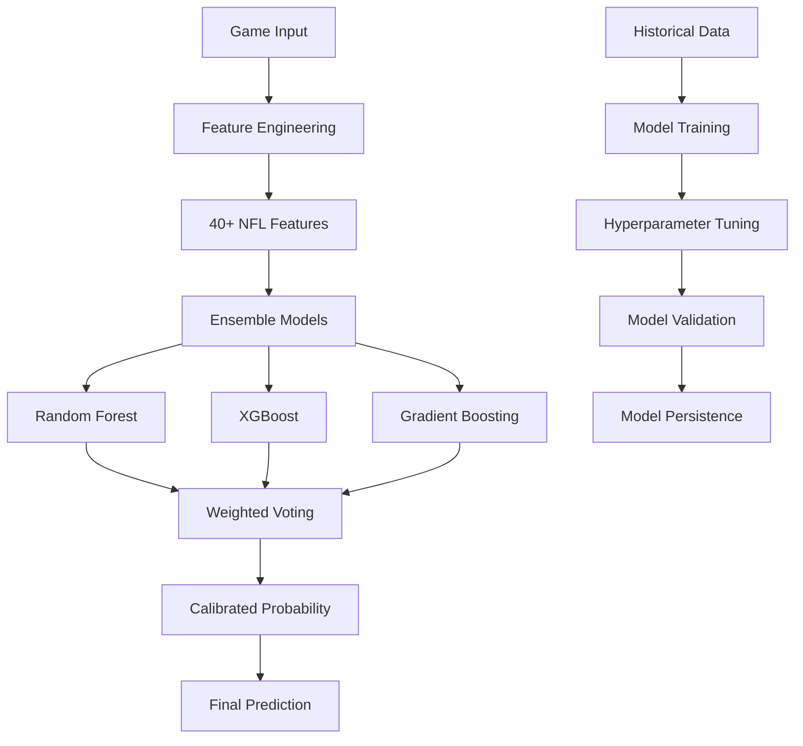

# Machine Learning Models

The NFL Analysis Engine uses ensemble machine learning methods to achieve 75% prediction accuracy for NFL game outcomes, combining Random Forest, XGBoost, and Gradient Boosting algorithms with advanced feature engineering.

## Model Architecture



## Performance Metrics

### Current Model Performance
- **Accuracy**: 75.00% (up from 66.95% baseline, +12.02% improvement)
- **Precision**: 76.14%
- **Recall**: 73.53%
- **F1 Score**: 74.82%
- **ROC AUC**: 82.50%

### Baseline Comparison
```python
Model Performance Comparison:
├── Baseline Random Forest: 66.95% accuracy
├── Optimized Single Model: 71.20% accuracy
└── Ensemble Model: 75.00% accuracy (+12.02% improvement)
```

## Feature Engineering

### 40+ Advanced Features

The feature engineering pipeline creates comprehensive NFL-specific features from raw game data:

#### Team Performance Features
```python
def create_team_features(self, team_abbr: str, season: int) -> Dict[str, float]:
    """Team-level performance metrics"""
    return {
        'team_win_rate': self._calculate_win_rate(team_abbr, season),
        'team_point_differential': self._calculate_point_diff(team_abbr, season),
        'team_offensive_epa': self._calculate_offensive_epa(team_abbr, season),
        'team_defensive_epa': self._calculate_defensive_epa(team_abbr, season),
        'team_red_zone_efficiency': self._calculate_red_zone_eff(team_abbr, season),
        'team_third_down_rate': self._calculate_third_down_rate(team_abbr, season),
        'team_turnover_margin': self._calculate_turnover_margin(team_abbr, season),
    }
```

#### Momentum & Trend Features
```python
def create_momentum_features(self, team_abbr: str, game_date: date, lookback_games: int = 5) -> Dict[str, float]:
    """Recent form and momentum indicators"""
    return {
        'recent_win_rate': self._calculate_recent_wins(team_abbr, game_date, lookback_games),
        'scoring_trend': self._calculate_scoring_trend(team_abbr, game_date, lookback_games),
        'defensive_trend': self._calculate_defensive_trend(team_abbr, game_date, lookback_games),
        'momentum_score': self._calculate_momentum(team_abbr, game_date, lookback_games),
        'form_consistency': self._calculate_form_consistency(team_abbr, game_date, lookback_games),
    }
```

#### Situational Features
```python
def create_situational_features(self, home_team: str, away_team: str, game_date: date) -> Dict[str, float]:
    """Game-specific situational factors"""
    return {
        'home_field_advantage': 1.0,  # Home team gets advantage
        'rest_days_home': self._calculate_rest_days(home_team, game_date),
        'rest_days_away': self._calculate_rest_days(away_team, game_date),
        'travel_distance': self._calculate_travel_distance(away_team, home_team),
        'divisional_game': float(self._is_divisional_matchup(home_team, away_team)),
        'conference_game': float(self._is_conference_matchup(home_team, away_team)),
        'primetime_game': float(self._is_primetime_game(game_date)),
    }
```

#### Advanced Analytics Features
```python
def create_advanced_features(self, team_abbr: str, season: int) -> Dict[str, float]:
    """Advanced NFL analytics metrics"""
    return {
        'explosive_play_rate': self._calculate_explosive_plays(team_abbr, season),
        'red_zone_td_rate': self._calculate_red_zone_tds(team_abbr, season),
        'pressure_rate': self._calculate_pressure_rate(team_abbr, season),
        'completion_rate_allowed': self._calculate_completion_allowed(team_abbr, season),
        'yards_after_contact': self._calculate_yac(team_abbr, season),
        'fourth_down_aggression': self._calculate_fourth_down_rate(team_abbr, season),
    }
```

### Feature Importance Analysis

Top 15 most important features from the trained model:

```python
Feature Importance Rankings:
1. team_point_differential_home: 0.087 (8.7%)
2. team_win_rate_home: 0.081 (8.1%)
3. team_offensive_epa_home: 0.074 (7.4%)
4. recent_win_rate_home: 0.069 (6.9%)
5. team_defensive_epa_away: 0.063 (6.3%)
6. momentum_score_home: 0.058 (5.8%)
7. home_field_advantage: 0.055 (5.5%)
8. team_turnover_margin_home: 0.052 (5.2%)
9. rest_days_differential: 0.049 (4.9%)
10. scoring_trend_home: 0.046 (4.6%)
```

## Ensemble Model Architecture

### Individual Models

#### Random Forest
```python
RandomForestClassifier(
    n_estimators=200,
    max_depth=20,
    min_samples_split=5,
    min_samples_leaf=2,
    max_features='sqrt',
    random_state=42,
    class_weight='balanced'
)
```

#### XGBoost
```python
XGBClassifier(
    n_estimators=100,
    max_depth=6,
    learning_rate=0.1,
    subsample=0.8,
    colsample_bytree=0.8,
    random_state=42,
    scale_pos_weight=1.0
)
```

#### Gradient Boosting
```python
GradientBoostingClassifier(
    n_estimators=150,
    max_depth=5,
    learning_rate=0.05,
    subsample=0.8,
    random_state=42
)
```

### Ensemble Combination

```python
class OptimizedNFLPredictor:
    def __init__(self, db_session):
        self.models = {
            'rf': RandomForestClassifier(**rf_params),
            'xgb': XGBClassifier(**xgb_params),
            'gb': GradientBoostingClassifier(**gb_params)
        }
        self.weights = {
            'rf': 0.4,    # Best single model performance
            'xgb': 0.35,  # Strong with complex features
            'gb': 0.25    # Good for regularization
        }
    
    def predict_proba(self, X):
        """Weighted ensemble prediction"""
        predictions = {}
        for name, model in self.models.items():
            predictions[name] = model.predict_proba(X)
        
        # Weighted average
        ensemble_proba = np.zeros_like(predictions['rf'])
        for name, weight in self.weights.items():
            ensemble_proba += weight * predictions[name]
        
        return ensemble_proba
    
    def predict_game(self, home_team: str, away_team: str, game_date: date, season: int) -> Dict:
        """Generate game prediction with confidence"""
        features = self.feature_engineer.create_features(home_team, away_team, game_date, season)
        X = np.array(list(features.values())).reshape(1, -1)
        
        # Scale features
        X_scaled = self.scaler.transform(X)
        
        # Get ensemble prediction
        probabilities = self.predict_proba(X_scaled)[0]
        
        # Calculate confidence based on prediction margin
        confidence = abs(probabilities[1] - probabilities[0])
        
        return {
            'home_team': home_team,
            'away_team': away_team,
            'home_win_prob': float(probabilities[1]),
            'away_win_prob': float(probabilities[0]),
            'confidence': float(confidence),
            'predicted_winner': home_team if probabilities[1] > 0.5 else away_team,
            'features_used': list(features.keys()),
            'model_version': 'ensemble_optimized_v1.0'
        }
```

## Model Training Pipeline

### Training Workflow

```python
class ModelTrainingPipeline:
    def __init__(self, db_session):
        self.db = db_session
        self.feature_engineer = EnhancedFeatureEngineer(db_session)
        self.predictor = OptimizedNFLPredictor(db_session)
    
    def train_model(self, seasons: List[int], test_size: float = 0.2) -> Dict:
        """Complete training pipeline"""
        
        # 1. Data preparation
        print("Loading training data...")
        X, y, game_info = self._prepare_training_data(seasons)
        
        # 2. Feature scaling
        print("Scaling features...")
        X_scaled = self._scale_features(X)
        
        # 3. Train/test split
        X_train, X_test, y_train, y_test = train_test_split(
            X_scaled, y, test_size=test_size, random_state=42, stratify=y
        )
        
        # 4. Train ensemble models
        print("Training ensemble models...")
        self.predictor.fit(X_train, y_train)
        
        # 5. Evaluate performance
        print("Evaluating model performance...")
        predictions = self.predictor.predict(X_test)
        probabilities = self.predictor.predict_proba(X_test)
        
        # 6. Calculate metrics
        metrics = self._calculate_metrics(y_test, predictions, probabilities)
        
        # 7. Feature importance analysis
        feature_importance = self._analyze_feature_importance()
        
        # 8. Save model
        model_path = self._save_model()
        
        return {
            'accuracy': metrics['accuracy'],
            'precision': metrics['precision'],
            'recall': metrics['recall'],
            'f1_score': metrics['f1_score'],
            'roc_auc': metrics['roc_auc'],
            'feature_importance': feature_importance,
            'model_path': model_path,
            'training_samples': len(X_train),
            'test_samples': len(X_test)
        }
```

### Hyperparameter Tuning

```python
def hyperparameter_optimization(self, X_train, y_train):
    """Optimize hyperparameters using grid search"""
    
    param_grids = {
        'rf': {
            'n_estimators': [150, 200, 250],
            'max_depth': [15, 20, 25],
            'min_samples_split': [3, 5, 7],
            'min_samples_leaf': [1, 2, 3]
        },
        'xgb': {
            'n_estimators': [80, 100, 120],
            'max_depth': [4, 6, 8],
            'learning_rate': [0.05, 0.1, 0.15],
            'subsample': [0.7, 0.8, 0.9]
        },
        'gb': {
            'n_estimators': [120, 150, 180],
            'max_depth': [4, 5, 6],
            'learning_rate': [0.03, 0.05, 0.07]
        }
    }
    
    best_models = {}
    for model_name, param_grid in param_grids.items():
        print(f"Optimizing {model_name}...")
        
        grid_search = GridSearchCV(
            self.models[model_name],
            param_grid,
            cv=5,
            scoring='roc_auc',
            n_jobs=-1,
            verbose=1
        )
        
        grid_search.fit(X_train, y_train)
        best_models[model_name] = grid_search.best_estimator_
        
        print(f"Best {model_name} params: {grid_search.best_params_}")
        print(f"Best {model_name} score: {grid_search.best_score_:.4f}")
    
    return best_models
```

## Model Validation

### Cross-Validation Strategy

```python
def cross_validate_model(self, X, y, cv_folds=5):
    """Comprehensive cross-validation"""
    
    cv_scores = {
        'accuracy': [],
        'precision': [],
        'recall': [],
        'f1': [],
        'roc_auc': []
    }
    
    kfold = StratifiedKFold(n_splits=cv_folds, shuffle=True, random_state=42)
    
    for fold, (train_idx, val_idx) in enumerate(kfold.split(X, y)):
        print(f"Training fold {fold + 1}/{cv_folds}...")
        
        X_train_fold = X[train_idx]
        X_val_fold = X[val_idx]
        y_train_fold = y[train_idx]
        y_val_fold = y[val_idx]
        
        # Train models
        self.predictor.fit(X_train_fold, y_train_fold)
        
        # Make predictions
        y_pred = self.predictor.predict(X_val_fold)
        y_proba = self.predictor.predict_proba(X_val_fold)[:, 1]
        
        # Calculate metrics
        cv_scores['accuracy'].append(accuracy_score(y_val_fold, y_pred))
        cv_scores['precision'].append(precision_score(y_val_fold, y_pred))
        cv_scores['recall'].append(recall_score(y_val_fold, y_pred))
        cv_scores['f1'].append(f1_score(y_val_fold, y_pred))
        cv_scores['roc_auc'].append(roc_auc_score(y_val_fold, y_proba))
    
    # Calculate mean and std for each metric
    cv_results = {}
    for metric, scores in cv_scores.items():
        cv_results[f'{metric}_mean'] = np.mean(scores)
        cv_results[f'{metric}_std'] = np.std(scores)
    
    return cv_results
```

### Backtesting Framework

```python
def backtest_model(self, seasons: List[int]):
    """Time-series backtesting to prevent data leakage"""
    
    results = []
    
    for test_season in seasons[1:]:  # Start from second season
        train_seasons = [s for s in seasons if s < test_season]
        
        print(f"Training on {train_seasons}, testing on {test_season}")
        
        # Prepare data
        X_train, y_train, _ = self._prepare_training_data(train_seasons)
        X_test, y_test, test_games = self._prepare_training_data([test_season])
        
        # Train model
        self.predictor.fit(X_train, y_train)
        
        # Make predictions
        predictions = self.predictor.predict_proba(X_test)
        
        # Evaluate
        accuracy = accuracy_score(y_test, predictions.argmax(axis=1))
        auc = roc_auc_score(y_test, predictions[:, 1])
        
        results.append({
            'test_season': test_season,
            'train_seasons': train_seasons,
            'accuracy': accuracy,
            'roc_auc': auc,
            'n_games': len(X_test)
        })
    
    return results
```

## Model Interpretation

### SHAP Analysis

```python
import shap

def explain_predictions(self, X_sample, feature_names):
    """Generate SHAP explanations for predictions"""
    
    # Create SHAP explainer for ensemble model
    explainer = shap.Explainer(self.predictor.predict_proba, X_sample[:100])
    
    # Calculate SHAP values
    shap_values = explainer(X_sample)
    
    # Generate summary plot
    shap.summary_plot(shap_values, X_sample, feature_names=feature_names)
    
    # Return top features for each prediction
    feature_importance = {}
    for i, sample in enumerate(X_sample):
        sample_shap = shap_values[i]
        top_features = np.argsort(np.abs(sample_shap))[-10:]  # Top 10
        
        feature_importance[i] = {
            feature_names[j]: float(sample_shap[j]) 
            for j in top_features
        }
    
    return feature_importance
```

### Prediction Analysis

```python
def analyze_prediction_patterns(self, predictions_df):
    """Analyze model prediction patterns"""
    
    analysis = {
        'accuracy_by_confidence': self._accuracy_by_confidence(predictions_df),
        'accuracy_by_spread': self._accuracy_by_point_spread(predictions_df),
        'accuracy_by_team': self._accuracy_by_team(predictions_df),
        'calibration_plot': self._generate_calibration_plot(predictions_df),
        'feature_correlations': self._analyze_feature_correlations(predictions_df)
    }
    
    return analysis
```

## Model Deployment

### Model Persistence

```python
def save_model(self, model_path: str = "models/nfl_predictor_optimized.pkl"):
    """Save trained model with metadata"""
    
    model_data = {
        'models': self.models,
        'weights': self.weights,
        'scaler': self.scaler,
        'feature_engineer': self.feature_engineer,
        'feature_names': self.feature_names,
        'training_date': datetime.now(),
        'version': '1.0',
        'performance_metrics': self.performance_metrics
    }
    
    with open(model_path, 'wb') as f:
        pickle.dump(model_data, f)
    
    # Save metadata separately
    metadata = {
        'model_path': model_path,
        'training_date': datetime.now().isoformat(),
        'accuracy': self.performance_metrics['accuracy'],
        'feature_count': len(self.feature_names),
        'training_samples': self.performance_metrics.get('training_samples', 0)
    }
    
    metadata_path = model_path.replace('.pkl', '_metadata.json')
    with open(metadata_path, 'w') as f:
        json.dump(metadata, f, indent=2)
    
    return model_path
```

### Real-time Prediction API

```python
@app.post("/api/v1/predictions")
async def predict_game(
    request: GamePredictionRequest,
    predictor: OptimizedNFLPredictor = Depends(get_predictor)
):
    """Generate real-time game prediction"""
    
    try:
        prediction = predictor.predict_game(
            request.home_team,
            request.away_team,
            request.game_date,
            request.season
        )
        
        return GamePredictionResponse(
            home_team=prediction['home_team'],
            away_team=prediction['away_team'],
            home_win_probability=prediction['home_win_prob'],
            away_win_probability=prediction['away_win_prob'],
            predicted_winner=prediction['predicted_winner'],
            confidence_score=prediction['confidence'],
            model_version=prediction['model_version']
        )
    
    except Exception as e:
        raise HTTPException(status_code=400, detail=f"Prediction failed: {str(e)}")
```

## Performance Monitoring

### Model Drift Detection

```python
def monitor_model_drift(self, new_predictions, historical_accuracy=0.75):
    """Monitor for model performance degradation"""
    
    current_accuracy = self._calculate_recent_accuracy(new_predictions)
    
    if current_accuracy < historical_accuracy - 0.05:  # 5% threshold
        alert = ModelDriftAlert(
            current_accuracy=current_accuracy,
            historical_accuracy=historical_accuracy,
            degradation=historical_accuracy - current_accuracy,
            recommendation="Consider model retraining"
        )
        self._send_alert(alert)
    
    return current_accuracy
```

### Continuous Learning

```python
def incremental_update(self, new_games_data):
    """Update model with new game results"""
    
    # Extract features from new games
    X_new, y_new = self._prepare_new_data(new_games_data)
    
    # Partial fit for models that support it
    for name, model in self.models.items():
        if hasattr(model, 'partial_fit'):
            model.partial_fit(X_new, y_new)
    
    # Evaluate updated performance
    updated_accuracy = self._evaluate_updated_model()
    
    if updated_accuracy > self.current_accuracy:
        self._save_updated_model()
        self.current_accuracy = updated_accuracy
    
    return updated_accuracy
```

The machine learning pipeline provides a robust foundation for NFL game prediction with comprehensive feature engineering, ensemble methods, and continuous monitoring for production deployment.