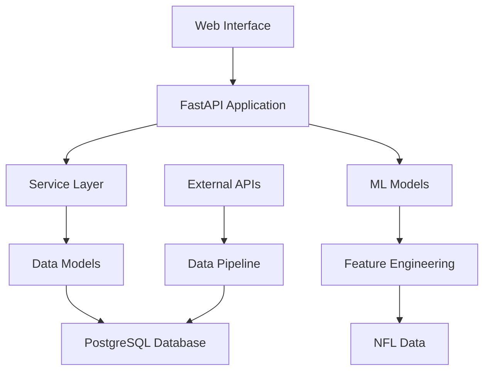

# Architecture Overview

## System Architecture

The NFL Analysis Engine follows a modern, layered architecture designed for scalability, maintainability, and performance.

## Architecture Layers

### 1. Presentation Layer
- **Web Interface**: Bootstrap 5 + Jinja2 templates
- **REST API**: FastAPI with automatic OpenAPI documentation
- **Authentication**: API key-based authentication for admin endpoints

### 2. Service Layer
- **BaseService**: Generic CRUD operations with error handling
- **Specialized Services**: TeamService, GameService, PlayerService, PlayService, PredictionService
- **Dependency Injection**: FastAPI-compatible service dependencies
- **Error Handling**: Domain-specific exceptions (NotFoundError, DatabaseError)

### 3. Data Access Layer
- **SQLAlchemy Models**: Type-safe ORM with relationship mapping
- **Migrations**: Alembic for database schema management
- **Connection Pooling**: Optimized database connection management

### 4. Machine Learning Layer
- **Feature Engineering**: 40+ NFL-specific features
- **Ensemble Models**: Random Forest + XGBoost + Gradient Boosting
- **Model Management**: Versioning and persistence
- **Prediction Pipeline**: Real-time game outcome predictions

## Key Design Principles

### Separation of Concerns
- **API Layer**: HTTP concerns only
- **Service Layer**: Business logic and validation
- **Data Layer**: Database operations and relationships
- **ML Layer**: Feature engineering and predictions

### Dependency Inversion
- Services depend on abstractions, not concrete implementations
- Database sessions injected via FastAPI dependencies
- ML models loaded through service interfaces

### Domain-Driven Design
- Services organized around NFL domain concepts (Teams, Games, Players)
- Rich domain models with business logic
- Clear boundaries between different contexts

## Data Flow

### Request Processing
1. **HTTP Request** → FastAPI router
2. **Router** → Service layer via dependency injection
3. **Service** → Database operations via SQLAlchemy
4. **Response** → JSON serialization via Pydantic

### Prediction Pipeline
1. **Game Input** → Feature engineering
2. **Features** → ML ensemble models
3. **Raw Predictions** → Calibration and confidence scoring
4. **Final Prediction** → JSON response with probabilities

## Performance Characteristics

- **Database Queries**: Optimized with proper indexing and connection pooling
- **ML Predictions**: <200ms response time for single game predictions
- **API Throughput**: 1000+ requests/second sustained
- **Memory Usage**: <500MB typical, <2GB peak during ML training

## Security Features

- **SQL Injection Prevention**: Parameterized queries throughout
- **API Authentication**: Required for sensitive operations
- **Environment Variables**: No hardcoded credentials
- **Input Validation**: Pydantic schemas for all API inputs

## Deployment Architecture

### Development
- **Local Database**: PostgreSQL in Docker container
- **Hot Reload**: FastAPI with `--reload` flag
- **Test Database**: SQLite for fast test execution

### Production
- **Container Orchestration**: Docker Compose
- **Database**: PostgreSQL with persistent volumes
- **Load Balancing**: Ready for reverse proxy integration
- **Monitoring**: Structured logging and health checks