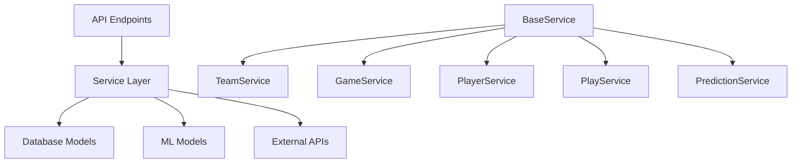

# Service Layer Architecture

The NFL Analysis Engine implements a comprehensive service layer that provides business logic abstraction, dependency injection, and clean separation between API endpoints and data access.

## Overview

The service layer serves as an intermediary between the API layer and data access layer, encapsulating business logic, validation, and error handling while maintaining clean code architecture.



## BaseService Architecture

### Generic CRUD Operations

The `BaseService` provides generic CRUD operations for all entity types:

```python
class BaseService(Generic[T, CreateSchemaType, UpdateSchemaType]):
    def __init__(self, db: Session, model: Type[T]):
        self.db = db
        self.model = model
    
    def get_by_id(self, entity_id: int) -> Optional[T]:
        """Get entity by ID with error handling"""
        return self.db.query(self.model).filter(self.model.id == entity_id).first()
    
    def list(self, limit: int = 100, offset: int = 0) -> List[T]:
        """List entities with pagination"""
        return self.db.query(self.model).offset(offset).limit(limit).all()
    
    def create(self, entity_data: CreateSchemaType) -> T:
        """Create new entity with validation"""
        db_entity = self.model(**entity_data.dict())
        self.db.add(db_entity)
        self.db.commit()
        self.db.refresh(db_entity)
        return db_entity
    
    def update(self, entity_id: int, entity_data: UpdateSchemaType) -> Optional[T]:
        """Update existing entity"""
        db_entity = self.get_by_id(entity_id)
        if not db_entity:
            return None
        
        for field, value in entity_data.dict(exclude_unset=True).items():
            setattr(db_entity, field, value)
        
        self.db.commit()
        self.db.refresh(db_entity)
        return db_entity
    
    def delete(self, entity_id: int) -> bool:
        """Delete entity by ID"""
        db_entity = self.get_by_id(entity_id)
        if not db_entity:
            return False
        
        self.db.delete(db_entity)
        self.db.commit()
        return True
```

### Error Handling Framework

```python
class ServiceError(Exception):
    """Base service exception"""
    pass

class NotFoundError(ServiceError):
    """Entity not found"""
    pass

class DatabaseError(ServiceError):
    """Database operation error"""
    pass

class ValidationError(ServiceError):
    """Data validation error"""
    pass
```

## Specialized Services

### TeamService

Handles team-specific operations including analytics calculation:

```python
class TeamService(BaseService[TeamModel, TeamCreate, TeamUpdate]):
    def __init__(self, db: Session):
        super().__init__(db, TeamModel)
    
    def get_by_abbreviation(self, abbr: str) -> Optional[TeamModel]:
        """Get team by abbreviation (e.g., 'KC', 'SF')"""
        return self.db.query(TeamModel).filter(TeamModel.team_abbr == abbr).first()
    
    def get_division_teams(self, division: str) -> List[TeamModel]:
        """Get all teams in a division"""
        return self.db.query(TeamModel).filter(TeamModel.team_division == division).all()
    
    def get_conference_teams(self, conference: str) -> List[TeamModel]:
        """Get all teams in a conference"""
        return self.db.query(TeamModel).filter(TeamModel.team_conf == conference).all()
    
    def calculate_team_analytics(self, team_abbr: str, season: int) -> TeamAnalytics:
        """Calculate comprehensive team analytics"""
        calculator = TeamAnalyticsCalculator(self.db)
        return calculator.calculate_team_analytics(season, team_abbr)[0]
```

### GameService

Manages game operations and statistics:

```python
class GameService(BaseService[GameModel, GameCreate, GameUpdate]):
    def __init__(self, db: Session):
        super().__init__(db, GameModel)
    
    def get_by_season(self, season: int) -> List[GameModel]:
        """Get games by season"""
        return self.db.query(GameModel).filter(GameModel.season == season).all()
    
    def get_team_games(self, team_abbr: str, season: int) -> List[GameModel]:
        """Get games for specific team in season"""
        return self.db.query(GameModel).filter(
            or_(
                GameModel.home_team == team_abbr,
                GameModel.away_team == team_abbr
            ),
            GameModel.season == season
        ).all()
    
    def get_completed_games(self, season: int) -> List[GameModel]:
        """Get completed games with scores"""
        return self.db.query(GameModel).filter(
            GameModel.season == season,
            GameModel.home_score.isnot(None),
            GameModel.away_score.isnot(None)
        ).all()
```

### PlayerService

Handles player operations and statistics:

```python
class PlayerService(BaseService[PlayerModel, PlayerCreate, PlayerUpdate]):
    def __init__(self, db: Session):
        super().__init__(db, PlayerModel)
    
    def get_by_position(self, position: str) -> List[PlayerModel]:
        """Get players by position"""
        return self.db.query(PlayerModel).filter(PlayerModel.position == position).all()
    
    def get_team_roster(self, team_abbr: str) -> List[PlayerModel]:
        """Get team roster"""
        return self.db.query(PlayerModel).filter(PlayerModel.team_abbr == team_abbr).all()
    
    def get_league_leaders(self, position: str, stat: str, limit: int = 10) -> List[dict]:
        """Get league leaders for specific position and stat"""
        # Implementation varies by position and stat
        return self._calculate_league_leaders(position, stat, limit)
    
    def calculate_player_stats(self, player_id: str, season: int) -> PlayerStats:
        """Calculate comprehensive player statistics"""
        calculator = PlayerStatsCalculator(self.db)
        return calculator.calculate_stats(player_id, season)
```

### PlayService

Manages play-by-play data operations:

```python
class PlayService(BaseService[PlayModel, PlayCreate, PlayUpdate]):
    def __init__(self, db: Session):
        super().__init__(db, PlayModel)
    
    def get_game_plays(self, game_id: str) -> List[PlayModel]:
        """Get all plays for a game"""
        return self.db.query(PlayModel).filter(PlayModel.game_id == game_id).all()
    
    def get_player_plays(self, player_id: str, season: int) -> List[PlayModel]:
        """Get plays involving specific player"""
        return self.db.query(PlayModel).filter(
            or_(
                PlayModel.passer_player_id == player_id,
                PlayModel.rusher_player_id == player_id,
                PlayModel.receiver_player_id == player_id
            ),
            PlayModel.season == season
        ).all()
    
    def get_key_plays(self, game_id: str) -> List[PlayModel]:
        """Get high-leverage plays (touchdowns, turnovers, big gains)"""
        return self.db.query(PlayModel).filter(
            PlayModel.game_id == game_id,
            or_(
                PlayModel.touchdown == 1,
                PlayModel.interception == 1,
                PlayModel.fumble_lost == 1,
                PlayModel.yards_gained >= 20
            )
        ).all()
```

### PredictionService

Handles ML predictions and model management:

```python
class PredictionService:
    def __init__(self, db: Session):
        self.db = db
        self.predictor = OptimizedNFLPredictor(db)
    
    def predict_game(self, home_team: str, away_team: str, 
                    game_date: date, season: int) -> GamePrediction:
        """Generate ML prediction for game"""
        try:
            prediction = self.predictor.predict_game(home_team, away_team, game_date, season)
            return GamePrediction(
                home_team=home_team,
                away_team=away_team,
                game_date=game_date,
                home_win_probability=prediction["home_win_prob"],
                away_win_probability=prediction["away_win_prob"],
                confidence_score=prediction["confidence"],
                model_version=prediction.get("model_version", "unknown")
            )
        except Exception as e:
            raise ValidationError(f"Prediction failed: {str(e)}")
    
    def get_model_performance(self) -> ModelPerformance:
        """Get current model performance metrics"""
        return self.predictor.get_performance_metrics()
    
    def retrain_model(self, seasons: List[int]) -> TrainingResult:
        """Retrain ML model with specified seasons"""
        result = self.predictor.train(seasons)
        return TrainingResult(
            accuracy=result["accuracy"],
            precision=result["precision"],
            recall=result["recall"],
            f1_score=result["f1_score"],
            training_time=result.get("training_time"),
            model_saved=result.get("model_saved", False)
        )
```

## Dependency Injection

### FastAPI Integration

Services are injected into API endpoints using FastAPI's dependency system:

```python
# Dependency providers
def get_team_service(db: Session = Depends(get_session)) -> TeamService:
    return TeamService(db)

def get_game_service(db: Session = Depends(get_session)) -> GameService:
    return GameService(db)

def get_player_service(db: Session = Depends(get_session)) -> PlayerService:
    return PlayerService(db)

def get_prediction_service(db: Session = Depends(get_session)) -> PredictionService:
    return PredictionService(db)

# Usage in API endpoints
@router.get("/teams/{team_abbr}")
async def get_team(
    team_abbr: str,
    team_service: TeamService = Depends(get_team_service)
):
    team = team_service.get_by_abbreviation(team_abbr.upper())
    if not team:
        raise HTTPException(status_code=404, detail="Team not found")
    return team
```

### Service Container

For more complex dependency management:

```python
class ServiceContainer:
    def __init__(self, db: Session):
        self.db = db
        self._services = {}
    
    def get_team_service(self) -> TeamService:
        if 'team' not in self._services:
            self._services['team'] = TeamService(self.db)
        return self._services['team']
    
    def get_game_service(self) -> GameService:
        if 'game' not in self._services:
            self._services['game'] = GameService(self.db)
        return self._services['game']
    
    def get_prediction_service(self) -> PredictionService:
        if 'prediction' not in self._services:
            self._services['prediction'] = PredictionService(self.db)
        return self._services['prediction']
```

## Transaction Management

### Service-Level Transactions

```python
class TeamService(BaseService[TeamModel, TeamCreate, TeamUpdate]):
    def bulk_update_analytics(self, updates: List[TeamAnalyticsUpdate]) -> List[TeamModel]:
        """Update analytics for multiple teams in single transaction"""
        try:
            updated_teams = []
            for update in updates:
                team = self.get_by_abbreviation(update.team_abbr)
                if team:
                    # Update team analytics
                    team.offensive_efficiency = update.offensive_efficiency
                    team.defensive_efficiency = update.defensive_efficiency
                    updated_teams.append(team)
            
            self.db.commit()
            return updated_teams
        
        except Exception as e:
            self.db.rollback()
            raise DatabaseError(f"Bulk update failed: {str(e)}")
```

### Cross-Service Operations

```python
class AnalyticsService:
    def __init__(self, db: Session):
        self.db = db
        self.team_service = TeamService(db)
        self.game_service = GameService(db)
        self.player_service = PlayerService(db)
    
    def generate_season_report(self, season: int) -> SeasonReport:
        """Generate comprehensive season analytics"""
        with self.db.begin():  # Explicit transaction
            teams = self.team_service.list()
            games = self.game_service.get_by_season(season)
            players = self.player_service.get_by_position("QB")
            
            return SeasonReport(
                season=season,
                team_count=len(teams),
                game_count=len(games),
                player_count=len(players),
                analytics=self._calculate_season_analytics(teams, games, players)
            )
```

## Testing Services

### Service Unit Tests

```python
class TestTeamService:
    def test_get_by_abbreviation(self, db_session):
        service = TeamService(db_session)
        team = service.get_by_abbreviation("KC")
        assert team is not None
        assert team.team_abbr == "KC"
    
    def test_get_division_teams(self, db_session):
        service = TeamService(db_session)
        afc_west = service.get_division_teams("AFC West")
        assert len(afc_west) == 4
        team_abbrs = [team.team_abbr for team in afc_west]
        assert "KC" in team_abbrs
        assert "LV" in team_abbrs
    
    def test_not_found_error(self, db_session):
        service = TeamService(db_session)
        team = service.get_by_abbreviation("XX")
        assert team is None
```

### Integration Tests

```python
class TestServiceIntegration:
    def test_prediction_workflow(self, db_session):
        team_service = TeamService(db_session)
        prediction_service = PredictionService(db_session)
        
        # Verify teams exist
        home_team = team_service.get_by_abbreviation("KC")
        away_team = team_service.get_by_abbreviation("BUF")
        assert home_team and away_team
        
        # Generate prediction
        prediction = prediction_service.predict_game(
            "KC", "BUF", date.today(), 2024
        )
        
        assert 0 <= prediction.home_win_probability <= 1
        assert 0 <= prediction.away_win_probability <= 1
        assert abs(prediction.home_win_probability + prediction.away_win_probability - 1.0) < 0.01
```

## Performance Considerations

### Caching

```python
from functools import lru_cache
from datetime import datetime, timedelta

class TeamService(BaseService[TeamModel, TeamCreate, TeamUpdate]):
    @lru_cache(maxsize=32)
    def get_team_analytics_cached(self, team_abbr: str, season: int) -> TeamAnalytics:
        """Cached team analytics (expires with new instance)"""
        return self.calculate_team_analytics(team_abbr, season)
    
    def get_team_analytics_with_ttl(self, team_abbr: str, season: int) -> TeamAnalytics:
        """Team analytics with TTL caching"""
        cache_key = f"team_analytics_{team_abbr}_{season}"
        cached_result = self._get_from_cache(cache_key)
        
        if cached_result and cached_result['expires'] > datetime.now():
            return cached_result['data']
        
        analytics = self.calculate_team_analytics(team_abbr, season)
        self._set_cache(cache_key, {
            'data': analytics,
            'expires': datetime.now() + timedelta(hours=1)
        })
        return analytics
```

### Query Optimization

```python
class GameService(BaseService[GameModel, GameCreate, GameUpdate]):
    def get_team_games_optimized(self, team_abbr: str, season: int) -> List[GameModel]:
        """Optimized query with eager loading"""
        return self.db.query(GameModel)\
            .options(joinedload(GameModel.home_team_obj))\
            .options(joinedload(GameModel.away_team_obj))\
            .filter(
                or_(GameModel.home_team == team_abbr, GameModel.away_team == team_abbr),
                GameModel.season == season
            ).all()
```

## Benefits

### Separation of Concerns
- **API Layer**: HTTP concerns only (routing, serialization, status codes)
- **Service Layer**: Business logic, validation, orchestration
- **Data Layer**: Database operations, relationships, persistence

### Testability
- Services can be unit tested independently
- Mock database sessions for isolated testing
- Integration tests verify service interactions

### Maintainability
- Business logic centralized in services
- Easy to modify behavior without changing API contracts
- Clear dependency relationships

### Reusability
- Services can be used by multiple API endpoints
- Background jobs can use services directly
- Web interface can share service logic with API